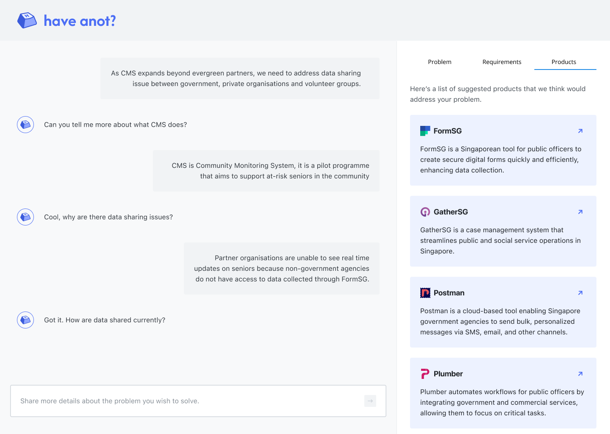

# have anot?



## Overview

[have anot?](https://have-anot.vercel.app/) is an AI-powered chatbot that assists users in effectively scoping their problems, suggesting features, and recommending existing products for digital solutions. By streamlining the entire process, have anot? enables public officers to minimize the need for completely bespoke systems. This approach helps them save both costs and time, ultimately enhancing their ability to serve citizens more effectively and efficiently.

have anot? was created as part of [Build for Good 2024](https://www.build.gov.sg/). Feel free to check out our [pitch deck](docs/pitch-deck.pdf)!

Start using [have anot?](https://have-anot.vercel.app/) now!

## Getting Started

1. Clone this repository.

```bash
git clone https://github.com/jasonqiu212/HaveAnot.git
cd HaveAnot
```

2. Create a `.env` file to store environment variables using `.env.sample` as a reference.

3. Install the required dependencies.

```bash
npm install
```

4. Start the development server.

```bash
npm run dev
```

Congratulations! You have successfully initialized have anot?. :tada:
